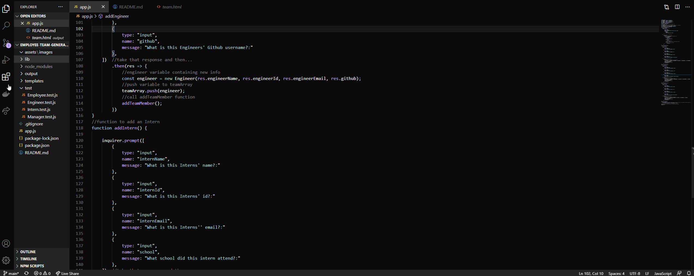

# employee-team-generator
The application will prompt the user for information about the team manager and then information about the team members. The user can input any number of team members, and they may be a mix of engineers and interns. This assignment must also pass all unit tests. When the user has completed building the team, the application will create an HTML file that displays a nicely formatted team roster based on the information provided by the user.

## Table of contents
- [General Info](#general-info)
- [Installation](#installation)
- [Usage](#usage)
- [Link to GitHub Repo](#link-to-github-repo)
- [Demo](#demo)
- [Technologies](#technologies)
- [Summary](#summary)
- [Author](#author)

## General Info
-This application meets the following criteria:

```
GIVEN a command-line application that accepts user input
WHEN I am prompted for my team members and their information
THEN an HTML file is generated that displays a nicely formatted team roster based on user input
WHEN I click on an email address in the HTML
THEN my default email program opens and populates the TO field of the email with the address
WHEN I click on the GitHub username
THEN that GitHub profile opens in a new tab
WHEN I start the application
THEN I am prompted to enter the team manager’s name, employee ID, email address, and office number
WHEN I enter the team manager’s name, employee ID, email address, and office number
THEN I am presented with a menu with the option to add an engineer or an intern or to finish building my team
WHEN I select the engineer option
THEN I am prompted to enter the engineer’s name, ID, email, and GitHub username, and I am taken back to the menu
WHEN I select the intern option
THEN I am prompted to enter the intern’s name, ID, email, and school, and I am taken back to the menu
WHEN I decide to finish building my team
THEN I exit the application, and the HTML is generated
```

## Installation
```md
Open file in integrated terminal
node app 
You will need to install all dependencies
npm i

```
## Usage
To run this app enter the following into an integrated terminal:
```
node app
```

## Link to GitHub Repo
- https://github.com/joshrehanek/employee-team-generator

## Demo
- 

## Technologies
- [node.js](https://nodejs.org/en//)
- [npm](https://www.npmjs.com/)
- [inquirer](https://www.npmjs.com/package/inquirer)
- [jest](https://jestjs.io/)


## Summary

- The application will prompt the user for information about the team manager and then information about the team members. The user can input any number of team members, and they may be a mix of engineers and interns. This assignment must also pass all unit tests. When the user has completed building the team, the application will create an HTML file that displays a nicely formatted team roster based on the information provided by the user.

## Author
-Joshua Azzam Rehanek